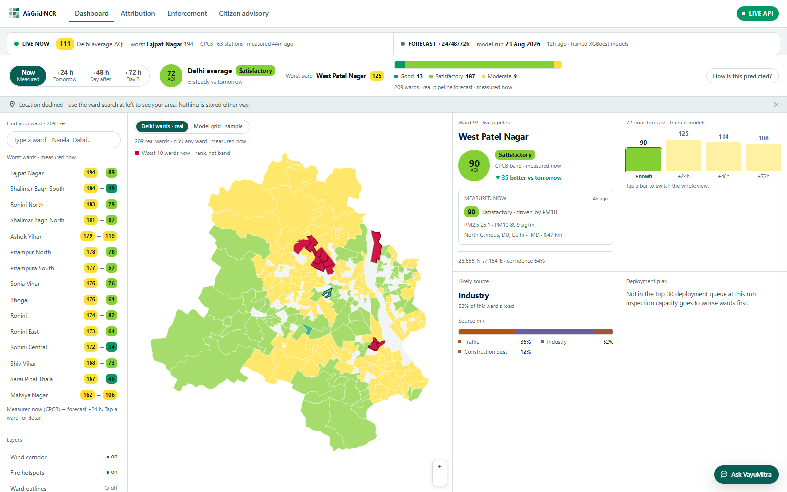
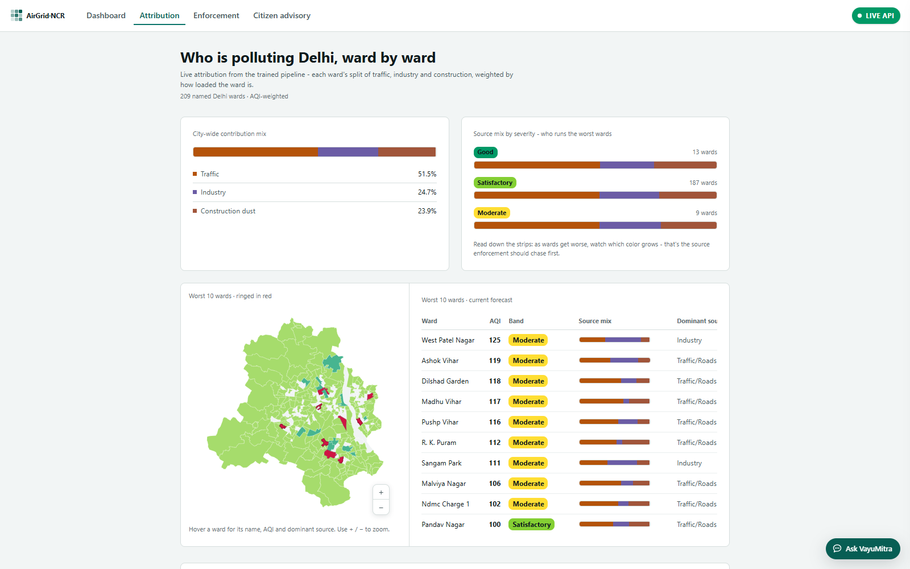
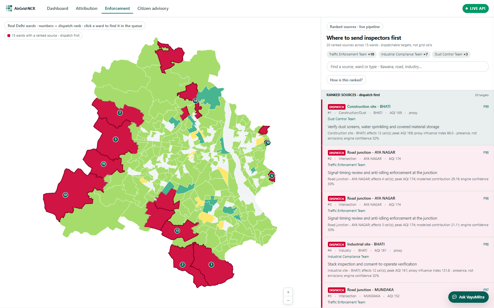
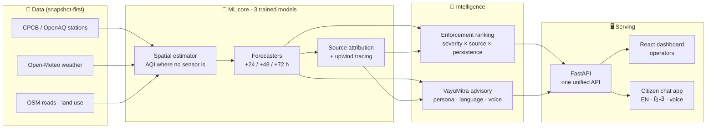

<div align="center">

# 🌬️ AirGrid · NCR

### Urban Air Quality Intelligence for Smart-City Intervention

**Delhi has ~60 government air-quality instruments and no intelligence layer. We built one.**

*Which source is polluting you right now · what the air will be in 24–72 hours ·
where to send inspectors · and what **you** personally should do - in your language.*

<br/>

[](https://vayumitra-advisory-u007.onrender.com)
[](https://airgrid-dashboard-47xp.onrender.com)
[](https://vayumitra-advisory-u007.onrender.com/docs)


<sub>ET AI Hackathon 2026 · Problem Statement 5 · Team: Suhani · Parth · Krishna · Bind</sub>

</div>

---

> ⏱️ **Judging in a hurry?** Open the **[dashboard](https://airgrid-dashboard-47xp.onrender.com)** and click **Now / +24 h / +48 h / +72 h** - **Now** is what ~60 government instruments are reading this hour; the rest are our trained forecasts. Every chart, map and ranking re-computes for **209 named Delhi wards**, and the 10 worst are painted red. The green **LIVE API** badge (top-right) links straight to the running **[Swagger docs](https://vayumitra-advisory-u007.onrender.com/docs)** - click it and watch the endpoints answer. Every page explains its own method in plain words ("How is this predicted?"). Then tap **Ask VayuMitra** (bottom-right, or the **[full app](https://vayumitra-advisory-u007.onrender.com)**): *"can my child play outside this evening?"*, **हिं** for Hindi, **sources** under any answer. That's all six features working end-to-end, deployed on real data.

---

## The problem

India's cities *measure* air pollution; they rarely *act* on it in time. Readings exist, but three questions stay unanswered every day:

1. **Which source** is driving pollution in *this* ward, *right now*?
2. **What will the air be** tomorrow and the day after - per locality, not city-wide?
3. **So what?** - where should inspectors go first, and what should a parent, an asthmatic, or an outdoor worker actually *do*?

**AirGrid** turns the existing sensor network into a ward-level intelligence layer that answers all three - for authorities *and* citizens.

## What we built - the five features

| # | Feature | What it does | Status |
|---|---------|--------------|:------:|
| 1 | **Hyperlocal AQI Forecasting** | 24/48/72-hour AQI per ~1 km cell - XGBoost forecasters + a spatial estimator predict air quality *where there are no sensors* | ✅ **live** |
| 2 | **Source Attribution** | Per cell: traffic vs industry vs construction vs regional burning, from **two independent lines of evidence** - upwind corridors over 958k mapped road segments and 517 industrial/construction sites, **cross-checked against live pollutant chemistry** (NO₂ → traffic, SO₂ → industry, PM10:PM2.5 → dust) and **NASA satellite fire detections** | ✅ **live** |
| 3 | **Enforcement Intelligence** | **20 dispatchable sources** ranked by priority - a named junction, a specific industrial site, a construction site - each with coordinates, the ward it sits in, the team to send, the action to take and the evidence behind it. Rebuilt automatically whenever the forecast refreshes | ✅ **live** |
| 4 | **Live Air Quality** | Current AQI for all **209 wards**, measured by ~60 real CPCB / DPCC / IMD instruments and refreshed every 10 minutes - kept visibly distinct from the model forecast, each stamped with its own age | ✅ **live** |
| 5 | **Citizen Health Advisory** 🌟 | **VayuMitra** - a multilingual (English/हिन्दी), voice-enabled assistant giving persona-specific advice (child · elderly · asthma · outdoor worker · pregnant), grounded in **CPCB · SAFAR · WHO · GRAP** citations | ✅ **live** |
| 6 | **Multi-City Comparison** | Same pipeline, second city (Mumbai) from one config block - band distribution, source mix, modelled intervention impact | ✅ built |

**On real data:** the deployed system serves the actual trained-pipeline output committed in `data/` - **1,600 one-km grid cells × 3 horizons**, aggregated to **209 named Delhi wards** (MCD boundaries), with a ranked deployment plan across all wards. Ask VayuMitra about *Chhawla* or *Narela* - those are real wards with real forecasts. Mumbai remains a labeled sample proving the multi-city architecture.

## See it

| Operator dashboard - 209 real wards, measured now | Citizen advisory (VayuMitra) |
|:---:|:---:|
|  |  |
| *Now / +24 / +48 / +72 - the map, the rail and every chart recompute · the 10 worst wards are painted red · "how is this predicted?" in plain words* | *Persona-aware, health-band-cited, English + हिन्दी, voice* |

| Source attribution - who is polluting, ward by ward | Enforcement - ranked sources, dispatch first |
|:---:|:---:|
|  |  |
| *Citywide mix, source mix by CPCB severity band, and the worst 10 wards ringed against the table* | *20 dispatchable targets - a named junction, a specific site - with the team, the action and the evidence behind each* |

## How it works



**Two layers, always distinguishable.** *Live* is what ~60 government instruments read in the last hour, refreshed every 10 minutes. *Forecast* is what our trained models predict for the next 24/48/72 hours, regenerated every 6 hours. Every screen states which it is showing and how old it is.

**The honest split:** four numeric models are **trained** (XGBoost - spatial estimation plus one forecaster per horizon); language is **called** (gpt-oss-120b via Groq, with deterministic fallbacks). Attribution combines geospatial evidence with live pollutant chemistry and reports confidence per cell - directional evidence, not plume physics, and the UI says so.

## Validation - measured, not claimed

All numbers from held-out validation ([`data/metrics.json`](data/metrics.json), served live at [`/metrics`](https://vayumitra-advisory-u007.onrender.com/metrics)).

**Spatial estimation** (Leave-One-Station-Out - predict each station's AQI using only the *other* stations):

We evaluated all 66 monitoring stations using exhaustive Leave-One-Station-Out (LOSO) spatial validation.

| Method | RMSE | vs. our model |
|---|---:|---:|
| **Our spatial model** | **72.8** | - |
| IDW interpolation (standard practice) | 85.4 | **+14.8% better** |
| Nearest station (what a citizen sees today) | 100.5 | **+27.5% better** |

**Forecasting** (RMSE vs. persistence - "assume today repeats"):

| Horizon | Model | Persistence | Verdict |
|---|---:|---:|---|
| +24 h | 43.0 | 41.3 | persistence competitive (−4.2%) |
| +48 h | **46.6** | 47.5 | model **+2.0%** |
| +72 h | **49.0** | 50.0 | model **+2.0%** |

We publish the 24-hour number even though persistence edges it - beating persistence at day-1 AQI is a known hard problem, and an RMSE of ~43 AQI (≈ half a CPCB band) still supports the band-level guidance the advisory gives. Where planning actually happens (2–3 days out, deployment and GRAP decisions), the trained models win.

## Why VayuMitra is different

Most AQI apps show a number and a color. VayuMitra answers *your* question:

- 📍 **Knows where you are** - allow location once and it resolves your exact MCD ward from the real boundaries (dashboard *and* chat); you can always change ward by search or tap.
- 🧒 **Persona-aware** - *"can my child play outside?"* answers differently than *"can I go for a run?"*. Sensitive groups (children, elderly, asthma/heart, pregnant, outdoor workers) are warned a band earlier.
- 📖 **Every answer cites authority** - CPCB National AQI bands, SAFAR advisories, WHO 2021 guidelines, and the active **GRAP stage** - tappable, with publisher and year. No invented thresholds: the LLM phrases only what the deterministic engine and cited sources establish.
- 🗣️ **Speaks your language** - full English/हिन्दी parity, neural text-to-speech with pause/stop, mic input. Built for low-literacy users, not just app-natives.
- 🛡️ **Never breaks in a demo** - no API key? Deterministic templates. No data? Committed sample. No network? Browser voice. Every layer degrades gracefully.
- ⚖️ **Guidance, not diagnosis** - every message carries the disclaimer; low false-positive tone by design.

## Run it locally

**Backend + citizen app** (zero-config - runs fully without any API key):

```bash
pip install -r requirements-advisory.txt
uvicorn backend.main:app --reload --port 8000
# → http://localhost:8000/citizen   (VayuMitra)
# → http://localhost:8000/docs      (all endpoints)
```

Optional `.env` (copy `.env.example`) - every key is optional and the app runs without all of them:

| Key | Free from | Unlocks |
|---|---|---|
| `OPENAQ_API_KEY` | [explore.openaq.org](https://explore.openaq.org) | the **live layer** - measured AQI, pollutant fingerprints; without it `/live` reports `available: false` and the UI shows the forecast layer, labelled as such |
| `FIRMS_MAP_KEY` | [firms.modaps.eosdis.nasa.gov](https://firms.modaps.eosdis.nasa.gov/api/map_key/) | regional biomass burning as a fourth source |
| `GROQ_API_KEY` | [console.groq.com](https://console.groq.com) | LLM phrasing; without it VayuMitra answers from deterministic CPCB templates |
| `DEEPGRAM_API_KEY` · `ELEVENLABS_API_KEY` | respective consoles | neural voice; without them the browser's own speech is used |

**Operator dashboard:**

```bash
cd frontend && npm install && npm run dev
# → http://localhost:8080
```

**Tests:** `python tests/test_advisory.py` → 20/20 offline (no keys, no network needed; pass on real and mock data).

## Deploy it

Both services are declared in [`render.yaml`](render.yaml) - **Render → New → Blueprint → pick this repo → Apply** creates them and wires them together (the dashboard's `VITE_API_URL` is filled in from the backend service automatically).

| Service | Runtime | Serves |
|---|---|---|
| `vayumitra-advisory` | Python | `/api/v1/*`, the advisory API, and VayuMitra at `/` |
| `airgrid-dashboard` | Node | the operator dashboard (`rootDir: frontend`) |

Only the secrets need typing, and every one is optional - with no keys the advisory still answers from deterministic CPCB templates and voice falls back to the browser:

- `OPENAQ_API_KEY` - free at [explore.openaq.org](https://explore.openaq.org). **This is the one that matters**: it powers the live AQI layer, the pollutant fingerprints and the 6-hourly forecast refresh. Without it the app still runs, on the committed forecast, and says so.
- `FIRMS_MAP_KEY` - free at [NASA FIRMS](https://firms.modaps.eosdis.nasa.gov/api/map_key/), for the regional-burning source
- `GROQ_API_KEY` - free at [console.groq.com](https://console.groq.com)
- `DEEPGRAM_API_KEY` (English voice) · `ELEVENLABS_API_KEY` (English + Hindi voice)

Two things worth knowing:

- **`*.onrender.com` names are globally unique.** To keep these exact URLs on a different account, delete the old services first - otherwise the names are taken and every link above changes.
- **Free instances sleep after ~15 min idle** (~30–60 s cold start). A keep-alive thread pings every 10 min to avoid that, but warming is not free: two always-on services spend roughly 1,440 instance-hours a month against a free allowance near 750 - which is what suspended our first deployment about four weeks in. Worth it across a judging window, not across a month. Set `KEEPALIVE=0` and warm the URLs by hand before a demo if the deployment needs to last.

## API at a glance

| Endpoint | Feature | Returns |
|---|:---:|---|
| `GET /api/v1/forecasts` | 1 | 24/48/72h AQI per cell |
| `GET /api/v1/attribution` | 2 | source %, confidence, evidence |
| `GET /api/v1/enforcement` | 3 | ranked action list |
| `GET /live` | 4 | **measured now** - AQI for all 209 wards from ~60 CPCB/DPCC/IMD instruments, with the pollutant fingerprint and regional-burning signal |
| `GET /wards` | 1+2 | 209 real wards: AQI + band + dominant source |
| `GET /deployment` | 3 | ranked ward-deployment plan (team + score per ward) |
| `GET /enforcement/top` | 3 | top-20 enforcement targets with evidence (grid cells) |
| `GET /enforcement/sources` | 3 | **top-20 dispatchable sources** - a named road, a specific site: coordinates, team, action, evidence |
| `GET /advisory` · `POST /chat` | 5 | cited, persona-specific advice (EN/HI) |
| `GET /tts` | 5 | streamed neural speech |
| `GET /compare` | 6 | multi-city summary + intervention model |
| `GET /sources` | 5 | the authority registry (CPCB · SAFAR · WHO · GRAP · NCAP) |
| `GET /metrics` | 1 | honest validation numbers (LOSO + vs-persistence) |
| `GET /locate` | 4+5 | GPS → your actual MCD ward (point-in-polygon on real boundaries) |

## Repository map

```
├── ml_pipeline/          # Feature 1: data fetch, training, prediction + enforcement scripts
├── scripts/              # in-service refreshers: forecast regen + enforcement target build
├── models/               # trained XGBoost artifacts (24/48/72h + spatial)
├── notebooks/            # Feature 2: geospatial source attribution (wind-corridor evidence)
├── backend/              # unified FastAPI (api/v1 + advisory + citizen app)
├── advisory/             # Feature 4: personas, CPCB bands, sources, LLM, translate, TTS
│                         #  + live.py, openaq.py, fingerprints.py, fire.py (the live layer)
├── compare/              # Feature 5: multi-city aggregation
├── frontend/             # React 19 operator dashboard (TanStack Start)
│   └── advisory_demo.html  # VayuMitra citizen app (self-contained)
├── config/city.yaml      # THE parameterisation: add a city = add a config block
├── data/                 # REAL pipeline output (forecasts, attribution, deployment)
│   └── mock/             # committed samples - everything still runs with zero data
├── PRODUCT.md · DESIGN.md  # our design system ("The Public Health Bulletin")
└── tests/                # 20 offline tests (pass on real AND mock data)
```

## Honesty notes (what we claim vs. don't)

- ✅ Ward-level estimation, forecasts, and attribution with stated confidence - **directional evidence**, not exact plume modelling.
- ✅ The live layer is genuinely live: ~60 government instruments polled through OpenAQ, refreshed every 10 minutes, quality-filtered before use, and stamped with its own observation time on every screen.
- ✅ Forecasts are regenerated **in-service every 6 hours** from that live feed - the deployed numbers are not a committed snapshot from training day.
- ✅ One city built deep (Delhi); the second city proves the architecture is a config block, not a rebuild.
- ✅ Language is a called LLM with deterministic fallbacks; it cannot invent health thresholds.
- ⚠️ Traffic sources carry modelled PM2.5 contributions; industry and construction carry a **proxy influence index** (presence and proximity, not measured emissions). Every row says which basis it used - we never mix the two.
- ❌ No claim of medical advice, official government status, or a production SLA - the live layer runs on free-tier infrastructure.

## Team

| | Built |
|---|---|
| **Suhani** | Data pipeline captaincy · Feature 4/5 co-design |
| **Parth** | Feature 2 source-attribution engine · dashboard frontend base |
| **Krishna** | Feature 1 forecasting models · Feature 3 enforcement engine |
| **Bind** | Feature 4 VayuMitra (advisory · voice · i18n) · Feature 5 · unified backend · deploy |

<div align="center">
<sub>Built in 3 weeks for ET AI Hackathon 2026 · PS5 · Made with care for the 30 million people breathing Delhi's air 🫁</sub>
</div>
